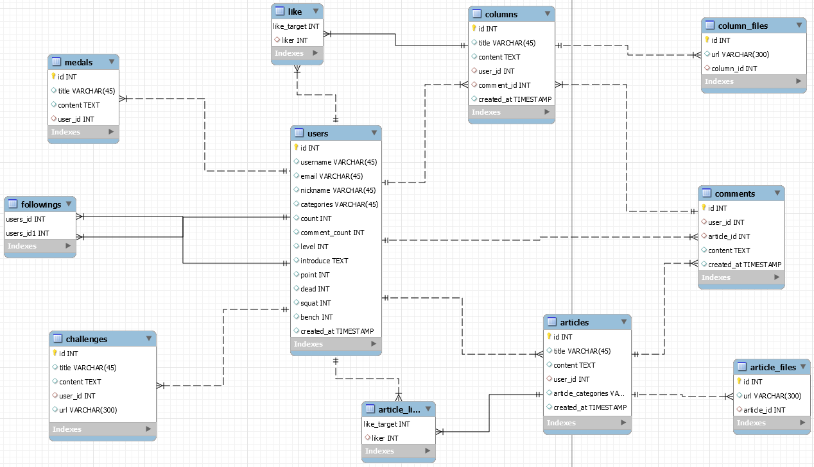

# Do Challenge, Be Healthy! Helngers 

## 🔖Index

#### Introduction

- [What is Helngers?](#🔩-What-is-Helngers?)
- [Project Intro](#🔩-Project-Intro)
- [ERD & Component](#📝-ERD-&-Component-structure)
- [UI Design](#🎨-UI-Design)

#### Features

#### Documents

- [Issues](#💬-Issues)

## 🔩 What is Helngers?

> **운동을 처음 시작하는 사람들**이 목표를 세우고 진행하며, 꾸준히 진행할 수 있도록 이끌어주는 **헬스 케어 SNS 서비스**

- 매일 갱신되는 챌린지를 달성하며 운동을 꾸준히 진행해 보세요.
- 비슷한 실력의 사람들과 소통하며 운동을 진행해 보세요.
- 코치들의 팁 게시글을 통해 운동 정보를 받아보세요.
- 운동 부위에 따라 받을 수 있는 메달을 모아 성장하는 자신을 확인해보세요.

## 🔩 Project Intro

- 진행 기간: 2021. 07. 05 ~ 2021. 08. 20
- 프로젝트 선정 배경
- 목표
  - 하루씩 변경되는 챌린지 기능(하루 도전 과제)
  - 운동한 영역별로 채워지는 메달
  - 운동 기록을 남길 수 있으며 비슷한 사람들과 소통하는 SNS기능
  - 비슷한 실력자끼리 추천해주는 친구 추천 큐레이팅 시스템

## 📝 ERD & Component structure

## 🎨 UI Design

*Figma 사용 / [UI 보러가기](https://www.figma.com/file/IHWkQyXMkvZwEM1JWKrzQ3/%EC%8B%B8%ED%94%BC-2%ED%95%99%EA%B8%B0-%EB%B6%80%ED%8A%B8%EC%BA%A0%ED%94%84?node-id=0%3A1)*

## 🔧 Features

### 1. Signup

회원 가입에 필요한 필수 회원 정보는 email, password, nickname이며, 자기소개 등의 다른 정보들은 추가적으로 받게됩니다. 따라서 회원 정보에 담을 모든 데이터를 `User Entity`에 담아줍니다. 회원 가입은 회원의 정보를 전송하여 요청하는 단계입니다. UserDto를 통해 데이터 객체를 만들어 파라미터로 사용하였으며, Dto를 받으면 Email, Nickname이 DB에서 다른 회원 정보와 겹치지 않는지 userService를 통해 확인합니다. 겹치지 않는다면 유저 데이터를 저장합니다. 저장 후 해당 User data를 불러와서 리턴해주면, 회원 가입시 직접 입력해준 값 외 다른 값들이 제대로 들어갔는지 확인할 수 있습니다.

### 2. Login

사용자가 로그인을 시도하면 우선 파라미터로 받아온 user정보를 userService의 login method를 통해 로그인을 시켜주고, 로그인 된 유저의 정보를 받아오도록 합니다. 다음으로 로그인한 유저의 JWT를 만들어 반환해줍니다.

로그인 메소드는, 입력한 Email을 갖는 유저 정보가 있는지 확인한 후, DB에 저장된 패스워드가 파라미터로 받은 패스워드와 일치하는지 확인합니다. 일치하면 User데이터를 반환, 그렇지 않으면 일치하는 아이디나 비밀번호가 존재하지 않다는 문구를 반환합니다.

### 3. Challenges

하루 도전 챌린지는 무작위로 5개를 선정해줍니다. 자정마다 5개씩 랜덤으로 선정되어 유저에게 배정이 됩니다. 이는 쿼리문에서 `select`, `insert`를 사용하여 로직을 설정해주었고, 이 쿼리문을 매퍼로 등록해줬습니다. 컨트롤러에서 파라미터를 이용하여 쿼리문에 변수를 넘겨주어 사용할 수 있도록 설정해주었습니다.

### 배포

📌[Helngers](i5c206.p.ssafy.io)

AWS(EC2) 서버로 배포하였다.

### 배포

📌[Helngers](i5c206.p.ssafy.io)

AWS(EC2) 서버로 배포하였다.

## 💬 Issues

### Tech Stack

    
FronEnd Tech Stack

    <ul>
        <li>Vue: </li>
        <li>Vue / CLI: </li>
        <li>Vuex: </li>
        <li>npm: </li>
        <li>axios: </li>
    </ul>

    
BackEnd Tech Stack

    <ul>
        <li>Swagger</li>
        <li>Spring Boot</li>
        <li>JavaMailSender</li>
        <li>MySQL</li>
        <li>NGINX</li>
        <li>E2C</li>
    </ul>

    
ETC

    <ul>
        <li>Json Web Token</li>
        <li>Github</li>
        <li>GitLab</li>
        <li>Jira</li>
        <li>Webex</li>
        <li>Discord</li>
    </ul>

### Contributor

|  이름  |   역할분담    |
| :----: | :-----------: |
| 박효진 | BackEnd repo  |
| 이태성 | FrontEnd repo |
| 정규원 | BackEnd repo  |
| 정상근 | FrontEnd repo |
| 조양훈 | BackEnd repo  |

#### 박효진(Park HyoJin)

> ✨[Github_HyojinPark1223](https://github.com/HyojinPark1223)

- Team Leader
- Backend
- Server
- Database
- UCC
- Design
- AWS

#### 이태성(Lee TaeSung)

> ✨[Github_2taesung](https://github.com/2taesung)

- Frontend
- Client
- Design

#### 정규원(Jeong KyuWon)

> ✨[Github_radio959](https://github.com/radio959)

- Backend
- Server
- Database
- Meeting Recorder
- Presentation

#### 정상근(Jeong SangGeun)

> ✨[Github_toproot](https://github.com/toproot)

- Frontend
- Client
- Notion
- Design
- Presentation

#### 조양훈(Cho YangHoon)

> ✨[Github_Soliloquiess](https://github.com/Soliloquiess)

- Backend
- Server
- Database

### Bug & Problem

✅ Code Mail 형식을 html로 변경하기

✅ `SQL.xml` mapper 연결(마이바티스 설정)

⬜ 전문 게시판을 따로 생성하기
